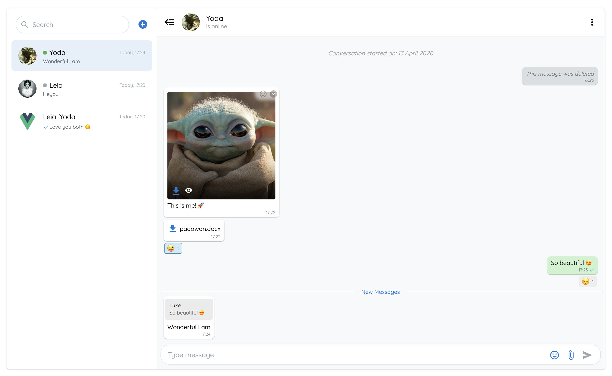

<p align="center">
<a href="https://travis-ci.org/antoine92190/vue-advanced-chat"></a>
<!-- <a href="https://codecov.io/github/antoine92190/vue-advanced-chat?branch=master"></a> -->
<a href="https://www.npmjs.com/package/vue-advanced-chat"></a>
<a href="https://www.npmjs.com/package/vue-advanced-chat"></a>
<a href="https://www.npmjs.com/package/vue-advanced-chat"></a>
<a href="https://www.npmjs.com/package/vue-advanced-chat"></a>
</p>

# vue-advanced-chat



## Features

- Realtime chat messaging
- Customizeable
- Backend agnostic
- Images, files & emojis
- Dark mode
- Firestore example

## [Demo](https://antoine92190.github.io/vue-advanced-chat)

Enjoy :smile:

## Table of Contents

- [Installation](#installation)
- [Usage](#example)
- [Props API](#props-api)
- [Props data structure](#props-data-structure)
- [Events API](#events-api)
- [Using with Firestore](#using-with-firestore)

## Installation

```bash
# Using npm
npm install --save vue-advanced-chat

# Using yarn
yarn add --save vue-advanced-chat
```

## Usage

You can import it as a custom component:

```javascript
<template>
  <chat-window :rooms="rooms" :messages="messages" />
</template>

<script>
  import ChatWindow from 'vue-advanced-chat'
  import 'vue-advanced-chat/dist/vue-advanced-chat.css'

  export default {
    components: {
      ChatWindow
    },
    data() {
      return {
        userId: '1234'
        rooms: [],
        messages: []
      }
    }
  }
</script>
```

## Props API

| Prop               | Type    | Required | Default |
| ------------------ | ------- | -------- | ------- |
| height             | String  | -        | 600px   |
| rooms              | Array   | -        | [ ]     |
| loadingRooms (1)   | Boolean | -        | false   |
| messages           | Array   | -        | [ ]     |
| messagesLoaded (2) | Boolean | -        | false   |
| menuActions (3)    | Array   | -        | [ ]     |
| showFiles          | Boolean | -        | true    |
| showEmojis         | Boolean | -        | true    |
| textMessages (4)   | Object  | -        | null    |
| theme (5)          | Sring   | -        | light   |
| colors (6)         | Object  | -        | (6)     |

(1) `loadingRooms` can be used to show/hide a spinner icon while rooms are loading

(2) `messagesLoaded` must be manually set to `true` when all messages of a conversation have been loaded. Meaning the user cannot scroll on top anymore

(3) `menuActions` can be used to display your own buttons when clicking the vertical dots icon inside a room.<br>
You can then use the [menuActionHandler](#events-api) event to call your own action after clicking a button. Ex:

```javascript
menuActions="[
  {
    name: 'inviteUser',
    title: 'Invite User'
  },
  {
    name: 'removeUser',
    title: 'Remove User'
  },
  {
    name: 'deleteRoom',
    title: 'Delete Room'
  }
]"
```

(4) `textMessages` can be used to replace default texts. Ex:

```javascript
textMessages="{
  MESSAGE_DELETED: 'Ce message a été supprimé',
  MESSAGES_EMPTY: 'Aucun message',
  CONVERSATION_STARTED: 'La conversation a commencée le :',
  TYPE_MESSAGE: 'Taper votre message',
  SEARCH: 'Rechercher'
}"
```

(5) `theme` can be used to change the chat theme. Currently, only `light` and `dark` are available.

(6) `colors` can be use to create your own theme. Ex:

```javascript
colors="{
  headerBg: '#fff',
  sidemenuBg: '#fff',
  sidemenuBgHover: '#f6f6f6',
  sidemenuBgActive: '#e5effa',
  sidemenuColorActive: '#1976d2',
  menuBg: '#fff',
  menuBgHover: '#f6f6f6',
  messagesBg: '#f8f9fa',
  textColorDark: '#0a0a0a',
  textColor: '#0a0a0a',
  inputBg: '#fff',
  spinnerColor: '#333',
  borderColor: '#d3dde7',
  iconsColor: {
    search: '#9ca6af',
    add: '#1976d2',
    menu: '#0a0a0a',
    close: '#9ca6af',
    closeImage: '#fff',
    file: '#1976d2',
    paperclip: '#1976d2',
    closeOutline: '#1976d2',
    send: '#1976d2',
    sendDisabled: '#9ca6af',
    emoji: '#1976d2',
    document: '#1976d2',
    pencil: '#1976d2',
    pencilEdited: '#9e9e9e',
    trash: '#f44336',
    checkmark: '#0696c7'
  }
}"
```

## Props data structure

Your props must follow a specific structure to display rooms and messages correctly:

### Rooms prop

```javascript
rooms="[
  {
    roomId: 1,
    roomName: 'Room 1',
    users: [
      {
        _id: 1234,
        username: 'John Doe'
      },
      {
        _id: 4321,
        username: 'John Snow'
      }
    ]
  }
]"
```

### Messages prop

Message objects are rendered differently depending on their type. Currently, only text, emoji and file types are supported.<br>
Each message object has a `sender_id` field which can have the value 'me' or the id of the corresponding agent.

```javascript
messages="[
  {
    content: 'message 1',
    sender_id: 1234,
    username: 'John Doe',
    date: '13 November',
    timestamp: '10:20',
    file: {
      name: 'My File',
      size: 67351,
      type: 'png',
      url: 'https://firebasestorage.googleapis.com/...'
    }
  }
]"
```

## Events API

| Event                 | Params                                        | Fires when                                            |
| --------------------- | --------------------------------------------- | ----------------------------------------------------- |
| fetchMessages (1)     | `{ room, options }`                           | A user has scrolled on top to load more messages      |
| sendMessage           | `{ roomId, content, file (3) }`               | A user has sent a message                             |
| editMessage           | `{ roomId, messageId, newContent, file (3) }` | A user has edited a message                           |
| deleteMessage         | `{ roomId, messageId }`                       | A user has deleted a message                          |
| uploadFile            | `{ roomId, messageId, file (3) }`             | A user has uploaded a file                            |
| addRoom               | -                                             | A user clicks on the plus icon next to searchbar      |
| menuActionHandler (2) | `{ roomId, action }`                          | A user clicks on the vertical dots icon inside a room |

(1) `fetchMessages` should be a method implementing a pagination system. Its purpose is to load older messages of a conversation when the user scroll on top

(2) `menuActionHandler` is the result of the `menuActions` prop.<br>
When clicking a button from your `menuActions` array, `menuActionHandler` will give you the name of the button that was click.
Then you can do whatever you want with it. Ex:

```javascript
menuActionHandler({ roomId, action }) {
  switch (action.name) {
    case 'inviteUser':
      // call a method to invite a user to the room
    case 'removeUser':
      // call a method to remove a user from the room
    case 'deleteRoom':
      // call a method to delete the room
  }
}
```

(3) All file params contain: `{ blob, localURL, name, size, type }`

## Using with Firestore

### Source code

You can find the source code to implement a full featured chat app using Firebase/Firestore inside the `demo` folder.
<br>
To test it using your own Firebase project:

- Clone this repository: `git clone https://github.com/antoine92190/vue-advanced-chat.git`
- Inside `demo/src/firestore/index.js` file, replace the line `const config = { ... }` by your own Firebase config
- Go inside `demo` folder and run `npm run serve`

### Data structure

If you decide to use the same code as in the `demo` folder to create your chat app, you need to have a specific Firestore data structure.<br>
To help you get started, I added in `demo/src/App.vue` a method `addData` to initialize some data on your Firestore database.

#### Users collection

```javascript
users: {
  USER_ID_1: {
    _id: 1,
    username: 'User 1'
  },
  USER_ID_2: {
    _id: 2,
    username: 'User 2'
  },
  USER_ID_3: {
    _id: 3,
    username: 'User 2'
  }
}
```

#### Rooms collection

```javascript
chatRooms: {
  ROOM_ID_1: {
    users: [1, 3]
  },
  ROOM_ID_2: {
    users: [1, 2, 3]
  }
}
```

#### Messages collection inside a room document

```javascript
messages: {
  MESSAGE_ID_1: {
    content: 'My first message',
    sender_id: 2,
    timestamp: 'December 11, 2019 at 4:00:00 PM UTC+2',
    seen: true
  }
}
```

## License

This project is licensed under [MIT License](http://en.wikipedia.org/wiki/MIT_License)
